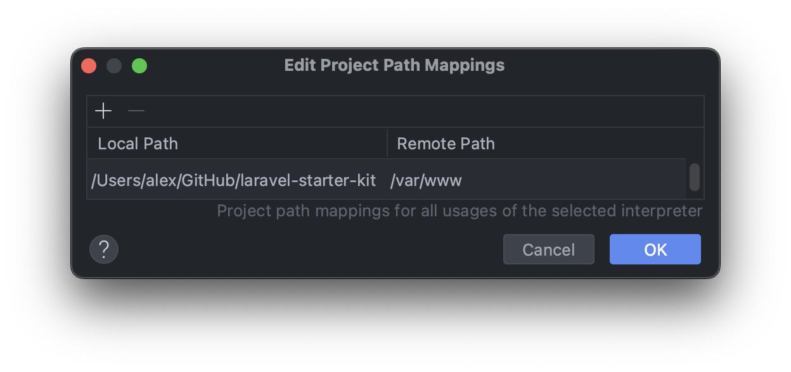
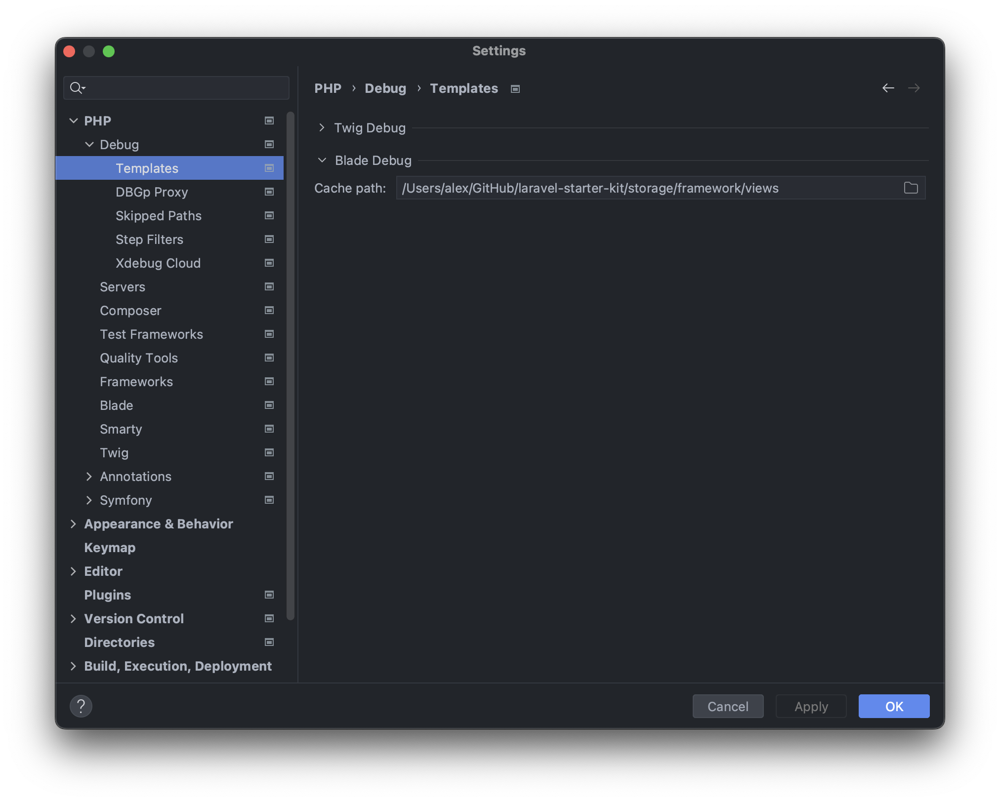
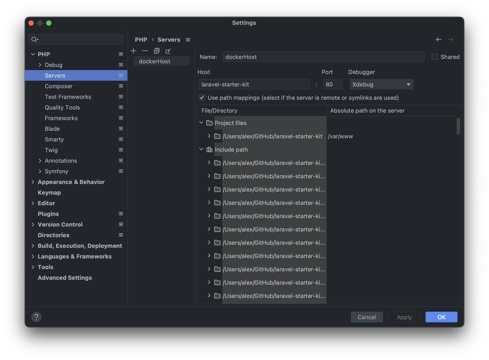
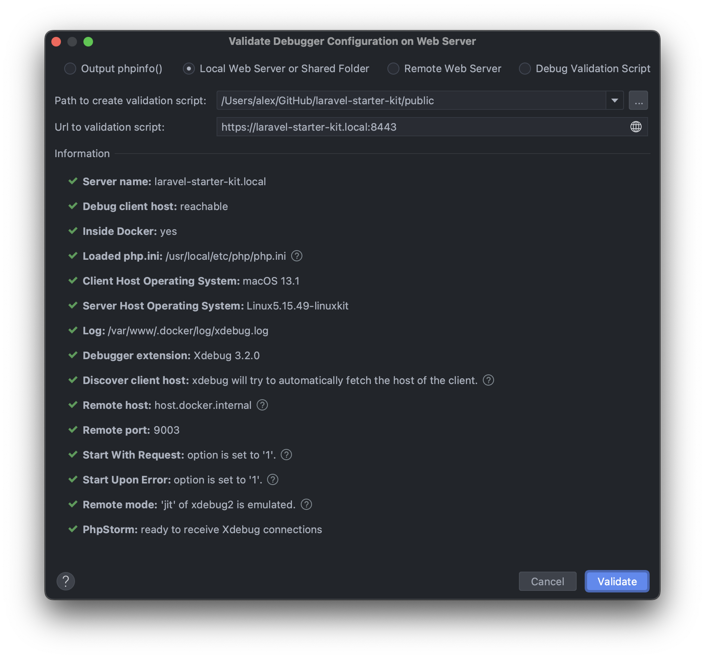
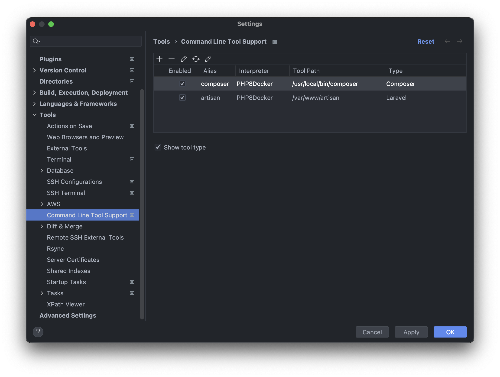

### PhpStorm IDE configuration.

📌 Specify mapping between local and remote project:

📌 Specify path to debug Blade templates:

📌 Add PHP debug server:

📌 Validate xDebug configuration:

📌 Support command line tools:

📌 Add PHP CS Fixer code inspector:

