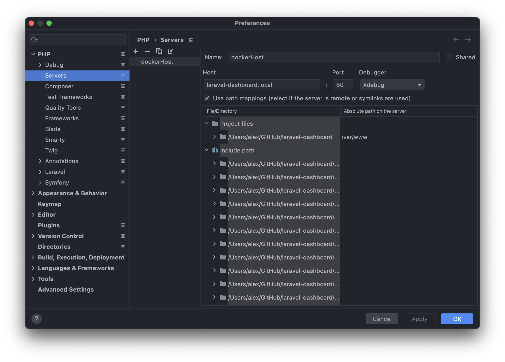
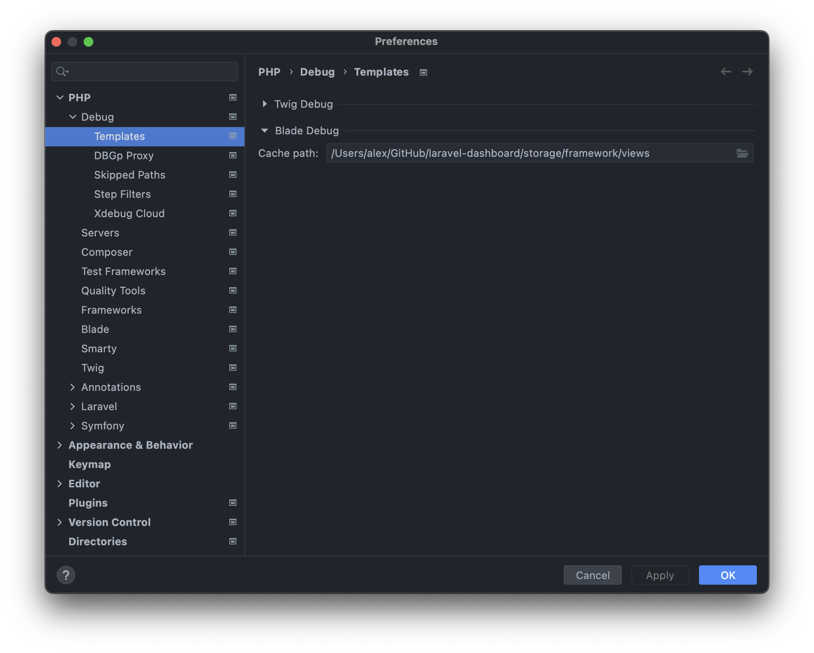

# laravel-dashboard

### Dashboard application based on PHP8/Laravel8. No JetStream. No Liveware. No Tailwind. Inspired by Django admin.

⚙️ Deployed on <a href="https://oleksiivelychkolaravelboard.herokuapp.com">Heroku</a>

📌 To login use credentials from <a href="https://github.com/oleksiivelychko/laravel-dashboard/blob/main/database/seeders/UserSeeder.php">seeder data</a>:
```
email: admin@test.test
password: secret
```

📌 Generate wildcard certificate:
```
openssl req -x509 -days 365 -out .docker/certs/localhost.crt -keyout .docker/certs/localhost.key \
      -newkey rsa:2048 -nodes -sha256 \
      -subj '/CN=laravel-dashboard.local' -extensions EXT -config <( \
       printf "[dn]\nCN=laravel-dashboard.local\n[req]\ndistinguished_name = dn\n[EXT]\nsubjectAltName=DNS:laravel-dashboard.local,DNS:mail.laravel-dashboard.local\nkeyUsage=digitalSignature\nextendedKeyUsage=serverAuth")

echo 127.0.0.1 laravel-dashboard.local mail.laravel-dashboard.local >> /etc/hosts
```


📌 Set up debug process in PhpStorm





The sample images were token from <a href="unsplash.com">unsplash.com</a> and <a href="icons8.com">icons8.com</a>
