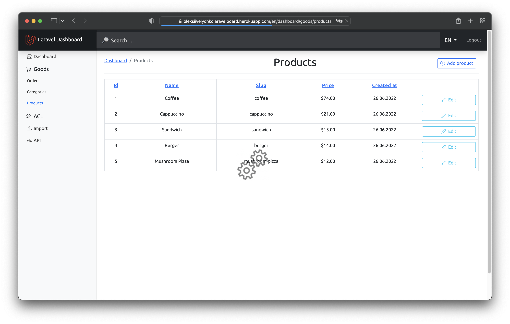

# laravel-starter-kit

### Dashboard management application based on PHP8/Laravel10. No JetStream. No Liveware. No Tailwind. Completely dockerized and fits great for local development.

📌 [Configure IDE](storage/md/ide_configuration.md)

📌 [Configure project](storage/md/configure_project.md)

📌 [Git commands](storage/md/git)

Sample images were taken from [unsplash.com](https://unsplash.com) and [icons8.com](https://icons8.com)
