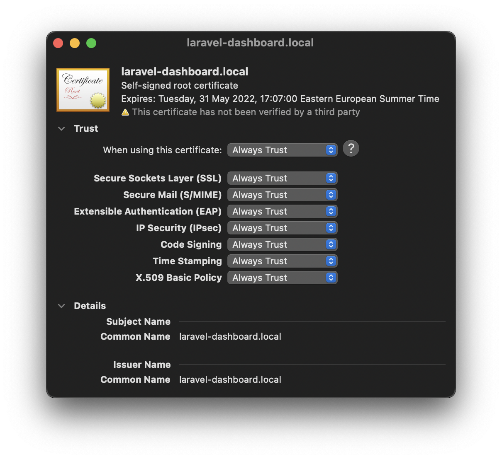

# laravel-dashboard

### Dashboard application based on PHP8/Laravel8. No JetStream. No Liveware. No Tailwind. Inspired by Django admin.

📌 Generate certificate:
```
openssl req -x509 -out .docker/certs/localhost.crt -keyout .docker/certs/localhost.key \
      -newkey rsa:2048 -nodes -sha256 \
      -subj '/CN=laravel-dashboard.local' -extensions EXT -config <( \
       printf "[dn]\nCN=laravel-dashboard.local\n[req]\ndistinguished_name = dn\n[EXT]\nsubjectAltName=DNS:laravel-dashboard.local\nkeyUsage=digitalSignature\nextendedKeyUsage=serverAuth")

echo 127.0.0.1 laravel-dashboard.local mail.laravel-dashboard.local >> /etc/hosts
```


