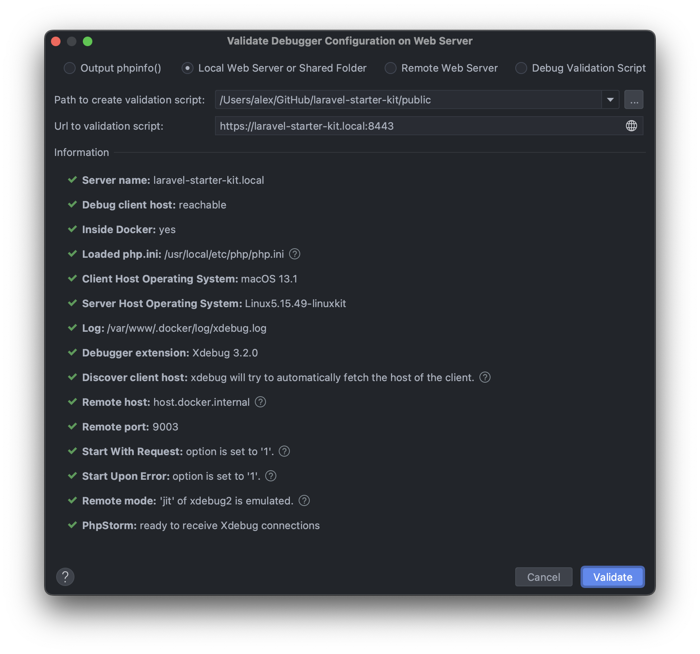

# laravel-starter-kit

### Dashboard management application based on PHP8/Laravel8. No JetStream. No Liveware. No Tailwind. Completely dockerized and ideal to start into local development.

📌 Use test credentials to get access to dashboard:
```
email: admin@test.test
password: secret
```


📌 Generate wildcard certificate:
```
openssl req -x509 -days 365 -out .docker/certs/localhost.crt -keyout .docker/certs/localhost.key \
      -newkey rsa:2048 -nodes -sha256 \
      -subj '/CN=laravel-starter-kit.local' -extensions EXT -config <( \
       printf "[dn]\nCN=laravel-starter-kit.local\n[req]\ndistinguished_name = dn\n[EXT]\nsubjectAltName=DNS:laravel-starter-kit.local,DNS:mail.laravel-starter-kit.local\nkeyUsage=digitalSignature\nextendedKeyUsage=serverAuth")

echo 127.0.0.1 laravel-starter-kit.local mail.laravel-starter-kit.local >> /etc/hosts
```

📌 Add certificate to `Keychain Access`:


📌 Set up debug process in PhpStorm:




The sample images were taken from <a href="unsplash.com">unsplash.com</a> and <a href="icons8.com">icons8.com</a>
